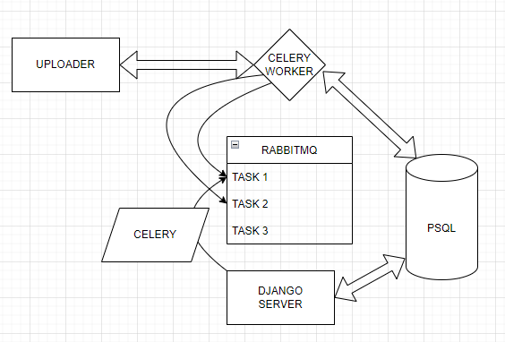

# Uploader

Uploader is Python project able to process csv files, summarize the rows and
group them into a more human-readable format.

Input:
```txt
Song,Date,Number of Plays
Umbrella,2020-01-02,200
Umbrella,2020-01-01,100
In The End,2020-01-01,500
Umbrella,2020-01-01,50
In The End,2020-01-01,1000
Umbrella,2020-01-02,50
In The End,2020-01-02,500
```
Output:
```
Song,Date, Total Number of Plays for Date
Umbrella,2020-01-01,150
Umbrella,2020-01-02,250
In The End,2020-01-01,1500
In The End,2020-01-02,500
```

## Architecture

The project is separated into 4 different services / parts:


- **Uploader**: Python package in charge of creating the output file. It's programmed with
Python, and there is a brute force approach designed for doing the task. Complexity O(N^2). More 
details about the method can be found in the code.


- **Django server and db**: Basically django is used as a framework for speeding up the API creation
and as well as the ORM functionalities. There is a model where the different files can be scheduled
while  Celery processes them.


- **RabbitMq**: Rabbit is the broker used with Celery that basically acts as an intermediate between
the API publishing tasks to the queues and Celery, that executes them.


- **Celery**: There is a celery worker running and executing the file transformations on background.

## Installation

All the code is built based on a multi container docker using docker-compose. Make sure you have
docker / DockerDesktop / docker-compose installed and just run:
```
docker-compose up
```

Checks to do:

1. Put in the browser: http://localhost:8000/admin/. Do you see the django administrator? Right!
2. Put in the browser: http://localhost:15672/. Do you see RabbitMQ interface? Perfect! You're done!
3. Run the tests of every part and check all is rolling fine:


## Usage

### 1. Uploader

Uploader is built with simple Python (>3), so you can try it out without any container
with an example file.
```sh
# You have some example files if you want to use it in `uploader/file_examples` 
python3 -m uploader --input-file=uploader/file_examples/data_100_rows.csv --output-file=results.csv
```
---
### 2. API
API is build with Django simple endpoints. I tried to keep it as simple as possible, so don't expect
any master DRF endpoints, and any crazy project architecture. Two available endpoints are:

#### 2.1. Uploading a file task


```sh
curl --location --request POST 'localhost:8000/api/schedule_file' --form 'file=@"your_path_to_project/uploader/file_examples/data_100_rows.csv"'
```

### Downloading a file
- http://localhost:8000/api/file_task/{task_id}/download

```SH
curl --location --request GET 'localhost:8000/api/file_task/{task_id}/download'
```

## Testing
Loader has its own tests, and it can be executed with simple Python 3 installed.

```sh
# In the root project (uploader folder level)
python3 -m unittest
```

In the other hand, django server has few tests for the endpoint implementations, that
can be run using the manage command test inside the docker:
```sh
# In the root project (uploader folder level)
docker-compose exec app python manage.py test
```
